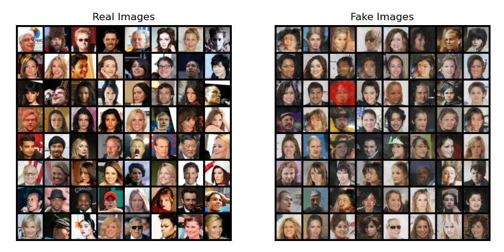

# Deep Convolutional Generative Adversarial Network (DCGAN)
한국어 버전의 설명은 [여기](./docs/README_ko.md)를 참고하시기 바랍니다.

## Introduction
The Deep Convolutional Generative Adversarial Network (DCGAN) is an algorithm that overcomes the limitations of vanilla GAN, a generative model, and experimentally refutes the notion that CNNs are black boxes.
Here, you can find the code for DCGAN and visualize the sequential changes in results generated during training on CelebA data in the form of a GIF file.
Additionally, you can compute the [Fréchet Inception Distance (FID) score](https://github.com/mseitzer/pytorch-fid) to assess the quality of the data generated by the trained model.
For detailed explanations about DCGAN, please refer to [Deep Convolutional Generative Adversarial Network (DCGAN)](https://ljm565.github.io/contents/DCGAN1.html)
<br><br><br>

## Supported Models
### DCGAM
DCGAN using convolutional layers is implemented.
<br><br><br>

## Base Dataset
* Base dataset for tutorial is [CelebA](http://mmlab.ie.cuhk.edu.hk/projects/CelebA.html) which contains faces of celebrities.
* Custom datasets can also be used by setting the path in the `config/config.yaml`.
However, implementing a custom dataloader may require additional coding work in `src/utils/data_utils.py`.
<br><br><br>

## Quick Start
```bash
python3 src/run/train.py --config config/config.yaml --mode train
```
<br><br>

## Project Tree
This repository is structured as follows.
```
├── configs                         <- Folder for storing config files
│   └── *.yaml
│
└── src      
    ├── models
    |   └── dcgan.py                  <- DCGAN model file
    |
    ├── run                   
    |   ├── cal_fid.py              <- Codes for calculating FID score
    |   ├── train.py                <- Training execution file
    |   └── validation.py           <- Trained model evaulation execution file
    | 
    ├── tools    
    |   ├── pytorch_fid             <- Codes for calculating FID score
    |   |   ├── fid_score.py
    |   |   └── inception.py
    |   |
    |   ├── model_manager.py          
    |   └── training_logger.py      <- Training logger class file
    |
    ├── trainer                 
    |   ├── build.py                <- Codes for initializing dataset, dataloader, etc.
    |   └── trainer.py              <- Class for training, evaluating, and FID calculation
    |
    └── uitls                   
        ├── __init__.py             <- File for initializing the logger, versioning, etc.
        ├── data_utils.py           <- File defining the custom dataset dataloader
        ├── filesys_utils.py       
        └── training_utils.py     
```
<br><br>

## Tutorials & Documentations
Please follow the steps below to train the DCGAN.
1. [Getting Started](./docs/1_getting_started.md)
2. [Data Preparation](./docs/2_data_preparation.md)
3. [Training](./docs/3_trainig.md)
4. ETC
   * [Evaluation](./docs/4_model_evaluation.md)
   * [FID Calculation](./docs/5_calculate_fid.md)
<br><br><br>

## Training Results
* Results of DCGAN<br><br>
<br><br>
<br><br>
<br><br><br>
